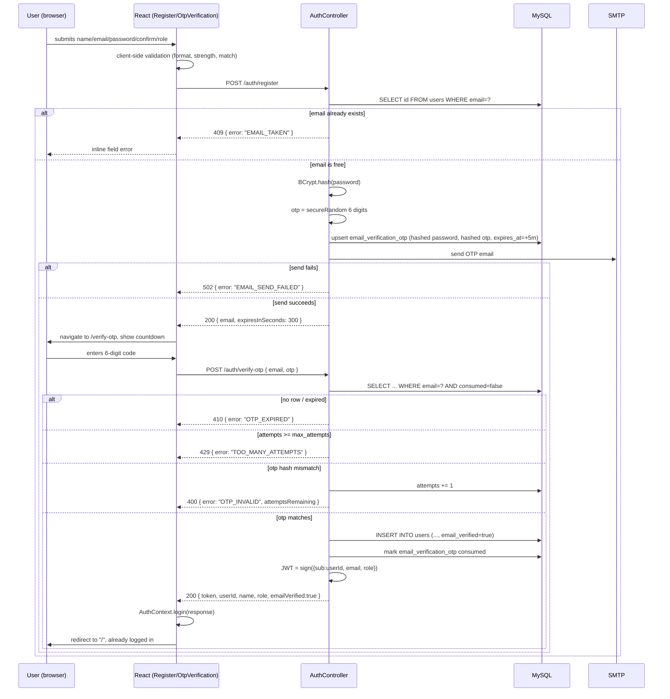
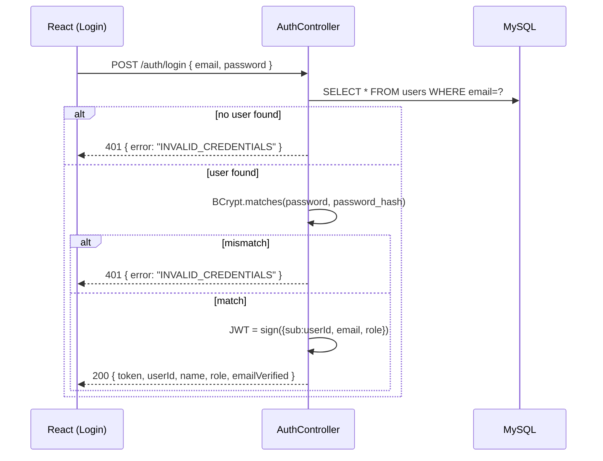
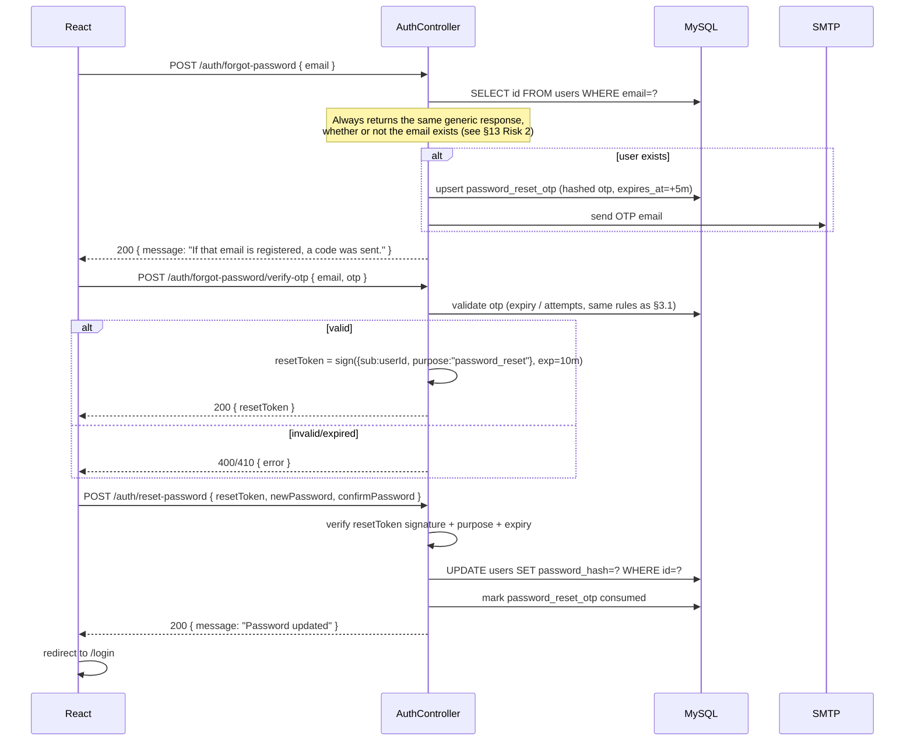

# Authentication System Design — Production-Ready Auth

Status: **proposed, not yet implemented**. Written per `CLAUDE.md`'s
workflow — this document must be reviewed and approved before any code
changes begin. It covers both repositories: the Spring Boot backend
(`../evcharging`) and this frontend (`evcharge-ui`), because the current
auth system is unsafe at the backend level (plaintext passwords, no JWT
validation, no email ownership check) and cannot be fixed from the
frontend alone.

## 0. Current state (verified by reading the code, not assumed)

**Backend** (`evcharging/src/main/java`)
- `AuthController` → `/auth/register`, `/auth/login`. No `/api` prefix
  (matches the rest of the backend's inconsistent routing —
  `API_REFERENCE.md`).
- `AuthService` uses raw JDBC (`DriverManager`), hardcoded DB credentials
  in the class, plaintext password `INSERT`, and `dbPassword.equals(password)`
  for login — no hashing anywhere.
- `login()` returns the literal string `"dummy-token"`, never calls
  `JwtUtil`. `JwtUtil.generateToken`/`validateToken` are dead code, and even
  if wired up, `Keys.secretKeyFor(...)` generates a **new random signing
  key every process start** — any restart invalidates every issued token.
- No Spring Security dependency in `pom.xml` at all. No filter chain, no
  request is ever authenticated. `spring-security-crypto` is declared but
  unused.
- `role` is a free-text column, only two values observed in the codebase:
  `"USER"`, `"OWNER"`.
- `users` table (inferred from the `INSERT`/`SELECT` statements — there is
  no entity/schema file): `id, name, email, password, role`. No
  `email_verified`, no timestamps, no constraints visible from the app
  layer (uniqueness on `email` is not verified — worth confirming directly
  against the DB before migration).
- `application.properties` commits the MySQL root password in plaintext
  (pre-existing issue, `IMPROVEMENT_REPORT.md` Critical #5 — not
  reintroduced here, but the new mail credentials must not repeat this
  mistake).

**Frontend** (`evcharge-ui/src`)
- `AuthContext`/`useAuth`/`ProtectedRoute`/`authApi.js` already exist
  (Module 1 from `ROADMAP.md` is done). `authApi.login()` already handles
  the "200 with empty body = invalid credentials" quirk;
  `authApi.register()` already text-sniffs for an `"Error"` prefix.
- `Login.jsx`/`Register.jsx` are already on shadcn `Card`/`Input`/`Button`
  with labeled fields and inline error states — the visual shell mostly
  matches what registration/OTP/reset pages need to look like; new pages
  should copy this shell rather than invent a new one.
- Role strings `"USER"` / `"OWNER"` appear in exactly three places:
  `App.jsx` (`ProtectedRoute role="OWNER"`), `Navbar.jsx`
  (`user?.role === "OWNER"`), `authApi.js` (register default `"USER"`).

This matters for the design below: the blast radius of this change can
stay contained to auth-specific files if the backend keeps `USER`/`OWNER`
as the stored role values (relabeled as "Customer"/"Station Owner" only in
the UI), rather than renaming the enum and touching those three unrelated
files.

---

## 1. Architecture Overview

```
┌──────────────┐        ┌────────────────────────────────────────┐        ┌──────────┐
│   React SPA   │  JSON  │        Spring Boot (port 8801)          │  JDBC  │  MySQL   │
│  (evcharge-ui)│◄──────►│                                          │◄──────►│ev_charging│
└──────────────┘         │  AuthController (/auth/**)              │        │  _system  │
                          │   ├─ RegistrationService (OTP issue)    │        └──────────┘
                          │   ├─ OtpService (generate/verify)       │
                          │   ├─ PasswordResetService               │              ▲
                          │   ├─ UserService (JPA, replaces JDBC)   │              │
                          │   └─ JwtService (sign/validate)         │              │
                          │  EmailService (JavaMailSender) ─────────┼──► SMTP ─────┘ (delivers OTP)
                          │  JwtAuthenticationFilter (Security chain)│
                          └────────────────────────────────────────┘
```

Only `AuthController`/`AuthService`/auth DTOs/`JwtUtil` and their new
supporting classes are touched. `StationController`, `BookingController`,
`OwnerController`, `ReportController` and their raw-JDBC services are
**not modified** — they are out of scope per `CLAUDE.md`, and this doc
does not propose changing them (a follow-on, separately-approved module
would be needed to make those endpoints actually enforce the JWT — see
§13, Risk 4).

New backend packages:
```
com.evcharging.evcharging
├── entity/            User, EmailVerificationOtp, PasswordResetOtp (JPA)
├── repository/         UserRepository, EmailVerificationOtpRepository,
                         PasswordResetOtpRepository (Spring Data JPA)
├── dto/                 (extended — see §5)
├── security/            JwtService, JwtAuthenticationFilter, SecurityConfig
├── service/              UserService, OtpService, EmailService,
                          RegistrationService, PasswordResetService
└── controller/           AuthController (rewritten)
```

---

## 2. Database Design

### 2.1 `users` (existing table, altered)

```sql
ALTER TABLE users
  CHANGE COLUMN password password_hash VARCHAR(255) NOT NULL,
  ADD COLUMN email_verified BOOLEAN NOT NULL DEFAULT FALSE,
  ADD COLUMN created_at TIMESTAMP NOT NULL DEFAULT CURRENT_TIMESTAMP,
  ADD COLUMN updated_at TIMESTAMP NOT NULL DEFAULT CURRENT_TIMESTAMP
      ON UPDATE CURRENT_TIMESTAMP,
  ADD UNIQUE KEY uq_users_email (email);
```

`role` stays `VARCHAR` with values `USER`, `OWNER`, and (new, unused until
an admin surface exists) `ADMIN` — not renamed to `CUSTOMER`, to avoid
touching the three frontend files listed in §0 that aren't otherwise part
of this change. The Register UI will *display* "Customer" / "Station
Owner" as labels that map to `USER`/`OWNER` values.

### 2.2 `email_verification_otp` (new)

Holds the **pending registration** — the account does not exist in
`users` until the OTP is verified, so this table has to carry the
not-yet-created user's data, not just a code.

```sql
CREATE TABLE email_verification_otp (
  id BIGINT AUTO_INCREMENT PRIMARY KEY,
  name VARCHAR(255) NOT NULL,
  email VARCHAR(255) NOT NULL,
  password_hash VARCHAR(255) NOT NULL,
  role VARCHAR(20) NOT NULL,
  otp_hash VARCHAR(255) NOT NULL,
  expires_at TIMESTAMP NOT NULL,
  attempts INT NOT NULL DEFAULT 0,
  max_attempts INT NOT NULL DEFAULT 5,
  resend_count INT NOT NULL DEFAULT 0,
  max_resends INT NOT NULL DEFAULT 3,
  last_sent_at TIMESTAMP NOT NULL,
  consumed BOOLEAN NOT NULL DEFAULT FALSE,
  created_at TIMESTAMP NOT NULL DEFAULT CURRENT_TIMESTAMP,
  INDEX idx_email_verification_email (email)
);
```

- Password is hashed with BCrypt **before** it ever touches this table —
  a plaintext password is never persisted, even transiently.
- The OTP itself is stored as a BCrypt hash (`otp_hash`), not plaintext,
  so a DB read (backup, replica, leaked dump) doesn't hand out live codes.
- A new registration attempt for the same email **overwrites** the
  existing unconsumed row (delete-then-insert) rather than accumulating
  rows — simplest correct behavior, and naturally caps abuse together with
  `max_resends`.

### 2.3 `password_reset_otp` (new)

```sql
CREATE TABLE password_reset_otp (
  id BIGINT AUTO_INCREMENT PRIMARY KEY,
  user_id BIGINT NOT NULL,
  otp_hash VARCHAR(255) NOT NULL,
  expires_at TIMESTAMP NOT NULL,
  attempts INT NOT NULL DEFAULT 0,
  max_attempts INT NOT NULL DEFAULT 5,
  resend_count INT NOT NULL DEFAULT 0,
  max_resends INT NOT NULL DEFAULT 3,
  last_sent_at TIMESTAMP NOT NULL,
  consumed BOOLEAN NOT NULL DEFAULT FALSE,
  created_at TIMESTAMP NOT NULL DEFAULT CURRENT_TIMESTAMP,
  CONSTRAINT fk_password_reset_user FOREIGN KEY (user_id) REFERENCES users(id),
  INDEX idx_password_reset_user (user_id)
);
```

### 2.4 `refresh_tokens` (future — schema only, not implemented now)

Included so the column shape doesn't need revisiting later; see §7 for
why issuing refresh tokens is deliberately deferred out of this module.

```sql
CREATE TABLE refresh_tokens (
  id BIGINT AUTO_INCREMENT PRIMARY KEY,
  user_id BIGINT NOT NULL,
  token_hash VARCHAR(255) NOT NULL,
  expires_at TIMESTAMP NOT NULL,
  revoked BOOLEAN NOT NULL DEFAULT FALSE,
  created_at TIMESTAMP NOT NULL DEFAULT CURRENT_TIMESTAMP,
  CONSTRAINT fk_refresh_token_user FOREIGN KEY (user_id) REFERENCES users(id)
);
```

---

## 3. Sequence Diagrams

### 3.1 Registration + OTP verification



### 3.2 Login



Note: both failure branches return the **same** `401 INVALID_CREDENTIALS`
— never "no such user" vs. "wrong password" separately, so login cannot
be used to enumerate registered emails.

### 3.3 Forgot password



---

## 4. API Contracts

Base path stays `/auth` (unprefixed), matching the existing
`AuthController` mapping and `services/api.js`'s existing `ROOT_URL`
escape hatch for un-prefixed controllers — not moved to `/api/auth`, to
avoid an unrelated routing change riding along with this one.

All responses below are JSON with a real HTTP status — this **replaces**
the current "always 200, sniff the text" contract for `/auth/**`
specifically (see §13 Risk 1 for why this is a deliberate, scoped
exception to "never redesign backend APIs").

| Method | Path | Auth | Purpose |
|---|---|---|---|
| POST | `/auth/register` | none | start registration, sends OTP |
| POST | `/auth/verify-otp` | none | complete registration, returns JWT |
| POST | `/auth/resend-otp` | none | resend registration OTP |
| POST | `/auth/login` | none | authenticate, returns JWT |
| POST | `/auth/forgot-password` | none | request password-reset OTP |
| POST | `/auth/forgot-password/verify-otp` | none | exchange OTP for a reset token |
| POST | `/auth/reset-password` | none (bears reset token) | set new password |

### `POST /auth/register`
```json
// request
{ "name": "Asha Rao", "email": "asha@example.com",
  "password": "Str0ngPass!", "confirmPassword": "Str0ngPass!",
  "role": "USER" }
// 200
{ "email": "asha@example.com", "expiresInSeconds": 300 }
// 400 — validation
{ "error": "VALIDATION_ERROR", "fields": { "confirmPassword": "Passwords do not match" } }
// 409 — duplicate
{ "error": "EMAIL_TAKEN", "message": "An account with this email already exists." }
```

### `POST /auth/verify-otp`
```json
// request
{ "email": "asha@example.com", "otp": "482913" }
// 200
{ "token": "<jwt>", "userId": 12, "name": "Asha Rao", "role": "USER", "emailVerified": true }
// 400
{ "error": "OTP_INVALID", "attemptsRemaining": 3 }
// 410
{ "error": "OTP_EXPIRED" }
// 429
{ "error": "TOO_MANY_ATTEMPTS" }
```

### `POST /auth/resend-otp`
```json
// request
{ "email": "asha@example.com" }
// 200
{ "expiresInSeconds": 300 }
// 429
{ "error": "RESEND_LIMIT_REACHED" }  // or "RESEND_TOO_SOON", { retryAfterSeconds }
```

### `POST /auth/login`
```json
// request
{ "email": "asha@example.com", "password": "Str0ngPass!" }
// 200
{ "token": "<jwt>", "userId": 12, "name": "Asha Rao", "role": "USER", "emailVerified": true }
// 401
{ "error": "INVALID_CREDENTIALS" }
```

### `POST /auth/forgot-password`
```json
{ "email": "asha@example.com" }
// 200 always (see §13 Risk 2)
{ "message": "If that email is registered, a code was sent." }
```

### `POST /auth/forgot-password/verify-otp`
```json
{ "email": "asha@example.com", "otp": "118204" }
// 200
{ "resetToken": "<short-lived jwt>" }
// 400 / 410 / 429 — same shape as §verify-otp
```

### `POST /auth/reset-password`
```json
{ "resetToken": "<jwt>", "newPassword": "N3wPass!", "confirmPassword": "N3wPass!" }
// 200
{ "message": "Password updated" }
// 400
{ "error": "VALIDATION_ERROR", "fields": { ... } }
// 401
{ "error": "RESET_TOKEN_INVALID" }
```

A `@RestControllerAdvice` (`AuthExceptionHandler`) maps typed exceptions
(`EmailTakenException`, `InvalidOtpException`, `OtpExpiredException`,
`TooManyAttemptsException`, `InvalidCredentialsException`,
`ValidationException`) to the status codes above, so controller methods
stay thin and every error path is uniform — no more `"Error: " +
e.getMessage()` string sniffing.

---

## 5. Security Model

- **Password hashing:** `BCryptPasswordEncoder` (Spring Security Crypto,
  already a declared but unused dependency — now actually used), default
  strength (10). Applied at registration-OTP-issue time and at
  reset-password time. Plaintext password never persisted, never logged.
- **Password strength policy** (enforced both client- and server-side):
  minimum 8 characters, at least one uppercase, one lowercase, one digit.
  Server-side enforcement is the real boundary; client-side is UX-only,
  consistent with `ARCHITECTURE_DECISIONS.md` §8's existing stance on
  validation.
- **OTP generation:** `java.security.SecureRandom`, 6 digits
  (`000000`–`999999`, zero-padded — do not exclude leading zeros).
- **OTP storage:** BCrypt hash, never plaintext, never logged. Comparison
  via `BCryptPasswordEncoder.matches`, which is constant-time.
- **OTP expiry:** 5 minutes from issue, checked server-side against
  `expires_at` on every verify attempt.
- **OTP single-use:** `consumed` flag set the instant it's successfully
  verified; a second verify attempt with the same code fails even if
  still within the expiry window.
- **OTP attempt limiting:** `max_attempts = 5` wrong guesses per issued
  code before the code is locked out (`429 TOO_MANY_ATTEMPTS`) — user must
  request a new one via resend.
- **OTP resend limiting:** `max_resends = 3` per registration/reset
  attempt, plus a 60-second cooldown between resends
  (`last_sent_at`-based) to blunt mail-bombing a target inbox.
- **JWT:** HS256, secret loaded from `app.jwt.secret` (environment
  variable / `application-local.properties`, **not committed** — this is
  the one new secret this change introduces, and it must not repeat the
  existing DB-password-in-source-control mistake called out in
  `IMPROVEMENT_REPORT.md` #5). Fixes the current bug where the signing key
  is regenerated randomly on every JVM restart. Claims: `sub` (user id),
  `email`, `role`, `iat`, `exp`. Access-token expiry: 24h (matches the
  existing, never-actually-used `JwtUtil` expiry, so it's not a UX
  regression from what was implicitly promised before). Refresh tokens are
  explicitly deferred — see §7.
- **Reset token:** also a signed JWT, but with `purpose: "password_reset"`
  and a 10-minute expiry, checked in `/auth/reset-password` in addition to
  signature/expiry, so a leaked access token can never be replayed as a
  password-reset credential and vice versa.
- **Role-based authorization:** roles remain `USER` / `OWNER`, with
  `ADMIN` added to the enum now (unused) so a future admin surface doesn't
  require another migration. Enforcement of role-per-endpoint on the
  *existing* business endpoints (`/owner/**`, `/api/users/{id}/bookings`,
  etc.) is explicitly **not** part of this module — see §13 Risk 4.
- **Rate limiting beyond OTP-specific counters:** not implemented in this
  pass (e.g., no IP-based throttle on `/auth/login`). Flagged as a
  reasonable follow-up, not blocking, since brute-forcing login is already
  mitigated by BCrypt's cost factor and this app has no lockout policy
  today either way — noted as a future hardening item, not silently
  addressed here.
- **User enumeration:** `/auth/login` and `/auth/forgot-password` both
  give identical responses regardless of whether the email exists (§3.2,
  §3.3) — the one deliberate deviation from the prompt's literal "verify
  account exists, else error" wording; flagged explicitly for approval in
  §13 Risk 2 rather than silently decided.

---

## 6. Email Flow

- **Dependency:** `spring-boot-starter-mail` (new — not currently in
  `pom.xml`).
- **Transport:** real SMTP, configured via `application.properties` /
  environment variables (`spring.mail.host`, `.port`, `.username`,
  `.password`, `.properties.mail.smtp.auth`,
  `.properties.mail.smtp.starttls.enable`). **This requires the user to
  supply real SMTP credentials** (a Gmail account with an App Password, a
  transactional-email provider's SMTP creds, or a local dev SMTP catcher
  like MailHog/Maildev bound to `localhost:1025`) — I cannot fabricate
  these, and "do not fake email verification" in the brief means a fake
  in-memory sender is explicitly out. This is called out again in §13 as
  a blocking dependency on the user, not something implementation can
  route around.
- **Sender:** `EmailService.sendOtpEmail(String to, String otpCode,
  OtpPurpose purpose)` — builds a small HTML string (subject +
  purpose-specific copy: "Verify your email" vs. "Reset your password"),
  sends via `JavaMailSender.send(MimeMessage)`. No templating engine
  dependency added for one email shape — a plain formatted `String` is
  enough and keeps the dependency list from growing.
- **Failure handling:** if `JavaMailSender` throws, the registration/
  forgot-password call fails loudly (`502 EMAIL_SEND_FAILED`) rather than
  silently "succeeding" with an OTP the user can never receive — this
  directly satisfies "do not fake email verification."
- **Content:** OTP code, 5-minute expiry notice, and a one-line "if you
  didn't request this, ignore this email" — no links, no HTML forms
  embedded, to keep the surface area (and phishing-lookalike risk) small.

---

## 7. JWT Lifecycle

```
issue (login / verify-otp) → attached as Authorization: Bearer <jwt> on
every request by services/api.js (already implemented) → validated by
JwtAuthenticationFilter on protected routes, including a revocation check
→ expires after 24h, or immediately on logout (Module 9) → client must log
in again (no silent refresh in this phase)
```

- **Why no refresh token yet, despite the brief listing "Future Refresh
  Tokens (if needed)":** the schema is included (§2.4) so adding it later
  is additive, not a migration. Issuing/rotating refresh tokens correctly
  (rotation on use, revocation on logout, replay detection) is a
  meaningfully sized second feature on its own, and bundling it into the
  same approval gate as "replace the entire auth system" makes this
  module harder to review and riskier to ship atomically. Recommend
  treating it as the next module once this one is stable in production.
- **Logout — updated by Module 9, no longer client-side only.**
  `AuthContext.logout()` calls `POST /auth/logout` (best-effort, before
  clearing local state regardless of the call's outcome), which extracts
  the token's `jti` claim and writes it to a `revoked_tokens` table.
  `JwtAuthenticationFilter` checks that table on every request; a revoked
  `jti` is treated the same as an expired one — left unauthenticated, not
  thrown as an error. This directly closes the limitation this section
  previously accepted (old text: "a token already issued remains
  technically valid until it expires even after logout") — see
  `CHANGELOG.md` Module 9 for the full implementation. `revoked_tokens` is
  kept small via an hourly `@Scheduled` purge of rows past their own
  `expires_at`, since a revoked token past its natural expiry adds nothing
  (the expiry check would already reject it).
- **Validation:** `JwtAuthenticationFilter` (a `OncePerRequestFilter`)
  reads the `Authorization` header, verifies signature + expiry via
  `JwtService`, checks the `jti` against `TokenRevocationService`, and —
  only if valid and unrevoked — populates `SecurityContextHolder` with an
  `Authentication` carrying the role as a `GrantedAuthority`. An
  invalid/expired/revoked/missing token simply leaves the request
  unauthenticated (no exception thrown from the filter itself); it's
  `SecurityConfig`'s per-path rules (real as of Module 9 — see below) that
  decide whether that's acceptable for the endpoint being hit.
- **Authorization — real as of Module 9.** §13 Risk 4 below described a
  deliberate gap: JWTs were issued and validated, but no endpoint outside
  `/auth/**` actually required one. Module 9 closes this: every business
  endpoint now requires authentication, `/owner/**` additionally requires
  `OWNER` or `ADMIN`, and `/api/users/{id}/bookings` /
  `/owner/reports/*/{ownerId}` additionally verify the path id matches the
  caller's own id (unless `ADMIN`) — see `CHANGELOG.md` Module 9 for the
  full per-endpoint rule table and the IDOR this closes.

---

## 8. Folder Changes

**Backend** (`evcharging/src/main/java`)
```
com/evcharging/evcharging/
├── entity/
│   ├── User.java                       new
│   ├── EmailVerificationOtp.java       new
│   └── PasswordResetOtp.java           new
├── repository/
│   ├── UserRepository.java             new (Spring Data JPA)
│   ├── EmailVerificationOtpRepository.java  new
│   └── PasswordResetOtpRepository.java new
├── security/
│   ├── JwtService.java                 replaces security/JwtUtil.java (static → bean, configurable secret)
│   ├── JwtAuthenticationFilter.java    new
│   └── SecurityConfig.java             new
├── service/
│   ├── UserService.java                new (JPA-backed; replaces the user-lookup parts of AuthService)
│   ├── OtpService.java                 new (generate/hash/verify/rate-limit, shared by both OTP flows)
│   ├── EmailService.java               new
│   ├── RegistrationService.java        new (orchestrates register → verify-otp → create user)
│   ├── PasswordResetService.java       new (orchestrates forgot-password → verify → reset)
│   └── AuthService.java                DELETED — replaced by the above, more focused services
├── dto/ (all under com.evcharging.evcharging.dto — existing location)
│   ├── RegisterRequest.java            extended: + confirmPassword
│   ├── VerifyOtpRequest.java           new
│   ├── ResendOtpRequest.java           new
│   ├── ForgotPasswordRequest.java      new
│   ├── VerifyResetOtpRequest.java      new
│   ├── ResetPasswordRequest.java       new
│   ├── AuthResponse.java               new (replaces LoginResponse's role as the shared success shape)
│   ├── ApiErrorResponse.java           new
│   ├── LoginRequest.java               unchanged
│   └── LoginResponse.java              kept as an alias of AuthResponse, or merged — see §13 note
└── controller/
    ├── AuthController.java             rewritten
    └── AuthExceptionHandler.java       new (@RestControllerAdvice, auth-scoped)
```

Existing `dto/*.java` (top-level, non-`com.evcharging.evcharging` package
— `RegisterRequest`, `LoginRequest`, `LoginResponse` currently at
`src/main/java/dto/`) are **not** the ones actually used by
`AuthController` (it imports `com.evcharging.evcharging.dto.*`) — those
top-level files appear to be dead/orphaned duplicates already. Flagged for
awareness; not deleted as part of this change unless the user confirms
they're unused elsewhere (a quick grep during implementation will confirm
before touching them).

**Frontend** (`evcharge-ui/src`)
```
pages/
├── Register.jsx              extended: name/email/password/confirm/role fields
├── VerifyOtp.jsx             new
├── ForgotPassword.jsx        new
├── ResetPassword.jsx         new (handles both the OTP-verify and new-password steps as a 2-step flow)
└── Login.jsx                 extended: "Forgot password?" link
components/shared/
├── OtpInput.jsx               new — 6-box OTP entry, used by VerifyOtp.jsx and ResetPassword.jsx
└── PasswordStrengthMeter.jsx  new — optional but cheap, matches "premium SaaS" direction
lib/
└── validation.js              new — isValidEmail, validatePasswordStrength, passwordsMatch (pure functions)
services/
└── authApi.js                 extended: verifyOtp, resendOtp, forgotPassword, verifyResetOtp, resetPassword
context/AuthContext.jsx         unchanged shape (already generic enough — verify-otp response is login-response-shaped)
App.jsx                         + routes: /verify-otp, /forgot-password, /reset-password
```

`OtpInput` is built as a shared component from the start (not
page-local-then-extracted) because both `VerifyOtp.jsx` and
`ResetPassword.jsx` need it on day one — the "second consumer" rule in
`COMPONENT_ARCHITECTURE.md` is already satisfied before either page is
written.

---

## 9. Backend Implementation Plan

Proposed as ordered sub-steps within this one module (still a single
approval gate, per `CLAUDE.md` — listed for sequencing clarity, not as
separate modules):

1. Add dependencies to `pom.xml`: `spring-boot-starter-mail`,
   `spring-boot-starter-security`. (`spring-security-crypto` and
   `jjwt-*` are already present.)
2. Add `app.jwt.secret` and `spring.mail.*` properties to
   `application.properties`, sourced from environment variables — **user
   must supply real values** (§13 Risk 5).
3. Run the DB migration SQL from §2 by hand against `ev_charging_system`
   (`spring.jpa.hibernate.ddl-auto=none` means nothing auto-applies this —
   confirmed from the existing `application.properties`).
4. One-time password-hashing migration: a guarded `CommandLineRunner`
   (behind `app.migration.hash-legacy-passwords=true`, default `false`)
   that reads every existing `users` row's plaintext password, BCrypt-hashes
   it in place, and sets `email_verified=true` for all pre-existing
   accounts (grandfathered in — they didn't go through OTP, but they
   already have working accounts and shouldn't be locked out). Run once,
   then flip the flag back to `false` (or delete the runner) — this is a
   migration tool, not a permanent feature.
5. Add `User`/`EmailVerificationOtp`/`PasswordResetOtp` JPA entities +
   Spring Data repositories.
6. Add `JwtService` (replaces `JwtUtil`), `OtpService`, `EmailService`.
7. Add `RegistrationService`, `PasswordResetService`, `UserService`.
8. Rewrite `AuthController` + new DTOs + `AuthExceptionHandler`.
9. Add `SecurityConfig` + `JwtAuthenticationFilter`: permit-all on
   `/auth/**` and `/health`; for every other existing path, **also
   permit-all for now** (preserves current behavior exactly — §13 Risk 4)
   but the filter still runs and populates `SecurityContext` when a valid
   token is present, so a later module can tighten `authorizeHttpRequests`
   without touching the filter again.
10. Delete the old `AuthService.java`.
11. Manual smoke test against the real backend (curl/Postman) for every
    endpoint in §4 before wiring the frontend.

## 10. Frontend Implementation Plan

1. `lib/validation.js` — pure validators, no dependencies.
2. `components/shared/OtpInput.jsx` — controlled 6-box input, paste
   support, auto-advance/backspace, exposes `value`/`onChange` like a
   normal form field so it composes with existing form patterns.
3. `services/authApi.js` — add `verifyOtp`, `resendOtp`, `forgotPassword`,
   `verifyResetOtp`, `resetPassword`; **rewrite `login`/`register`** to
   expect real JSON + status codes (removing the text-sniffing workarounds
   now that the backend contract is fixed — this is the one place old
   frontend logic is deleted, not just extended).
4. `pages/Register.jsx` — add Confirm Password + Account Type
   (`Select`: "Customer" label → `USER` value, "Station Owner" label →
   `OWNER` value); client-side validation via `lib/validation.js`; on
   success, `navigate("/verify-otp", { state: { email } })`.
5. `pages/VerifyOtp.jsx` — new page, no `MainLayout` (matches
   Login/Register), `OtpInput`, countdown timer from
   `expiresInSeconds`, "Resend code" button (disabled during cooldown /
   after `RESEND_LIMIT_REACHED`), on success calls
   `useAuth().login(response)` then redirects to `/`.
6. `pages/ForgotPassword.jsx` — email field, on success
   `navigate("/reset-password", { state: { email } })`.
7. `pages/ResetPassword.jsx` — step 1 (`OtpInput` → exchanges for
   `resetToken`), step 2 (new password + confirm, using the same
   `PasswordStrengthMeter`/validators as Register), on success
   `navigate("/login")` with a success toast (`sonner`, already wired in
   `App.jsx`).
8. `App.jsx` — add the three new routes, outside `MainLayout` like
   `/login`/`/register`.
9. `Login.jsx` — add a "Forgot password?" link near the password field.

---

## 11. Testing Strategy

`ARCHITECTURE_DECISIONS.md` §10 deliberately keeps this app test-light
today ("no test suite exists... prioritize manual checklists first").
Auth is the one area that justifies deviating from that default — it's
security-critical and has non-obvious edge cases (expiry, attempt limits,
resend limits) that are easy to regress silently. Proposed, scoped to
auth only:

**Backend (JUnit, already available via `spring-boot-starter-test`
parent)**
- `OtpServiceTest`: expiry boundary, max-attempts lockout, max-resend
  lockout, resend-cooldown timing, hash/verify round-trip.
- `JwtServiceTest`: sign → validate round-trip, expired-token rejection,
  tampered-signature rejection, reset-token `purpose` mismatch rejection.
- `RegistrationServiceTest` / `PasswordResetServiceTest`: happy path +
  each failure branch from §3's sequence diagrams, with the repository
  layer mocked.
- One `@SpringBootTest` + `MockMvc` integration test per endpoint in §4
  hitting a real (test) MySQL schema, or H2 in MySQL-compat mode if the
  user prefers not to stand up a second MySQL instance for tests —
  flagged as a decision to confirm, not assumed.

**Frontend**
- Manual checklist (extends `ROADMAP.md`'s per-module convention):
  - [ ] Register with a real, reachable email → OTP actually arrives.
  - [ ] Enter correct OTP → account created, auto-logged-in, lands on `/`.
  - [ ] Enter wrong OTP 5 times → locked out, told to resend.
  - [ ] Let the OTP expire (wait 5+ min) → verify fails with expiry error.
  - [ ] Resend 3 times → 4th resend blocked.
  - [ ] Register with an already-used email → inline "already exists"
        error, no OTP sent.
  - [ ] Login with correct credentials → JWT stored, Navbar reflects
        logged-in state.
  - [ ] Login with wrong password → generic invalid-credentials error.
  - [ ] Full forgot-password → OTP → reset-token → new password → login
        with the new password succeeds, old password fails.
  - [ ] `/history`, `/owner` still redirect to `/login` when logged out
        (regression check against Module 1's existing `ProtectedRoute`).
  - [ ] Refresh mid-session → still logged in (localStorage persistence
        unchanged).

---

## 12. Migration Strategy From Current Authentication

1. **Schema first, code second, in a maintenance window** — the SQL in
   §2 must run against `ev_charging_system` before the new backend code
   is deployed, since the new code expects `password_hash`,
   `email_verified`, and the two new tables to already exist. This is not
   zero-downtime; acceptable for this app's current stage (pre-production,
   single environment) but worth stating explicitly rather than assuming.
2. **Don't drop the old column immediately.** `CHANGE COLUMN password
   password_hash` in §2.1 is written as a rename+repurpose, but the safer
   sequence is: (a) add `password_hash` as a *new* column, (b) run the
   one-time hashing migration (§9 step 4) writing into `password_hash`
   while leaving `password` untouched, (c) deploy the new code reading
   `password_hash`, (d) once stable for a release cycle, drop the old
   `password` column in a follow-up migration. This makes the change
   reversible up until step (d) — if something's wrong post-deploy, the
   old column's data is still there to roll back to.
3. **Existing users are grandfathered as `email_verified=true`** — they
   already have working accounts; retroactively demanding OTP
   verification from them would be a regression, not a security
   improvement (their email was never disproven, just never proven).
4. **Rollback plan:** revert the backend deploy to the previous commit;
   because step 2 keeps the old `password` column intact until deliberately
   dropped, the previous `AuthService` (if the commit is reverted) can
   still authenticate against it. The two new tables
   (`email_verification_otp`, `password_reset_otp`) are additive and
   harmless to leave in place during a rollback. The frontend's old
   `authApi.js` behavior would need reverting alongside it — plan to
   deploy frontend and backend together, not independently, for this
   change specifically (unlike most of this app's other modules, which
   are frontend-only and backend-agnostic).
5. **No feature flag / dual-write period** — given this is pre-production
   with a small, known user set, a full cutover (old endpoints replaced,
   not run in parallel) is simpler and lower-risk than maintaining two
   auth code paths simultaneously. Flagged as a decision, not an
   oversight — revisit only if this were a live production app with
   active sessions that couldn't tolerate a coordinated deploy.

---

## 13. Risks — needs explicit sign-off before implementation begins

1. **Scope exception to "never redesign backend APIs."** This module
   changes `/auth/**`'s request/response contract (real status codes and
   JSON error bodies, replacing the always-200-plaintext contract). This
   is a deliberate, narrow exception justified by the user's explicit
   instruction to redesign auth end to end — flagged so it's an approved
   exception, not a silent violation of `CLAUDE.md`'s general rule. No
   other controller's contract changes.
2. **User enumeration trade-off.** The brief's literal flow says "verify
   account exists [...] else error" for forgot-password. §3.3/§5 instead
   return an identical response whether or not the email is registered,
   which is the standard security practice (prevents an attacker from
   using forgot-password to discover valid emails) but is a deviation from
   the literal spec. **Needs a decision:** ship the generic-response
   version (recommended), or the literal "account not found" version.
3. ~~**Logout doesn't revoke the JWT server-side.**~~ **Resolved in
   Module 9.** A `revoked_tokens` table + per-token `jti` claim now let
   logout actually invalidate that specific token server-side, checked on
   every request by `JwtAuthenticationFilter`. See §7 and `CHANGELOG.md`
   Module 9.
4. ~~**Existing business endpoints stay unauthenticated.**~~ **Resolved in
   Module 9.** Every endpoint now requires authentication at minimum;
   `/owner/**` requires `OWNER`/`ADMIN`; per-resource ownership is checked
   on `/api/users/{id}/bookings` and `/owner/reports/*/{ownerId}`. See §7
   and `CHANGELOG.md` Module 9 for the full rule table.
5. **Real SMTP credentials are a hard external dependency.** Nothing in
   this codebase can send a real email without them. The user needs to
   provide: an SMTP host/port, a sending account (Gmail App Password,
   a transactional provider, or a local dev catcher like MailHog for
   testing without real delivery), before OTP email can be verified
   end-to-end. Implementation is blocked on this for any environment
   where actual delivery needs to be tested.
6. **Existing `users` table's actual constraints are unverified.** The
   design assumes `email` has no existing `UNIQUE` constraint (adding one
   in §2.1) and that no duplicate emails currently exist — if duplicates
   exist today, the `ADD UNIQUE KEY` migration will fail outright and
   needs a manual dedup pass first. Should be checked directly against the
   live table before running the migration, not assumed.
7. **Orphaned top-level DTOs** (`src/main/java/dto/*.java`, distinct from
   `com/evcharging/evcharging/dto/*.java`) appear unused by any
   controller — flagged in §8, not deleted without confirming nothing
   else references them.

---

## 14. Explicit Non-Goals (this module)

- No refresh tokens (schema only — §7).
- ~~No server-side logout/session revocation.~~ Resolved in Module 9 (§7).
- ~~No enforcement of JWT/roles on non-auth endpoints.~~ Resolved in
  Module 9 (§7).
- No admin registration/login surface (role added to the enum and now
  fully supported by authorization rules as of Module 9, but no UI or
  endpoint targets it yet — there is still nothing for an admin to do).
- No rate limiting beyond the OTP-specific counters in §5.
- No change to any controller other than `AuthController` — **superseded
  by Module 9**, which deliberately does touch `StationController`,
  `BookingController`, and `ReportController` (ownership checks only, no
  business-logic changes) since authorization hardening was that module's
  explicit charter.

---

This document was reviewed and approved before Module 8 (auth rebuild)
began; Module 9 (authorization & security hardening) was approved and
implemented as a follow-up per §13 Risks 3 and 4 above. See `CHANGELOG.md`
for the full record of both modules, including what was verified live and
how.
